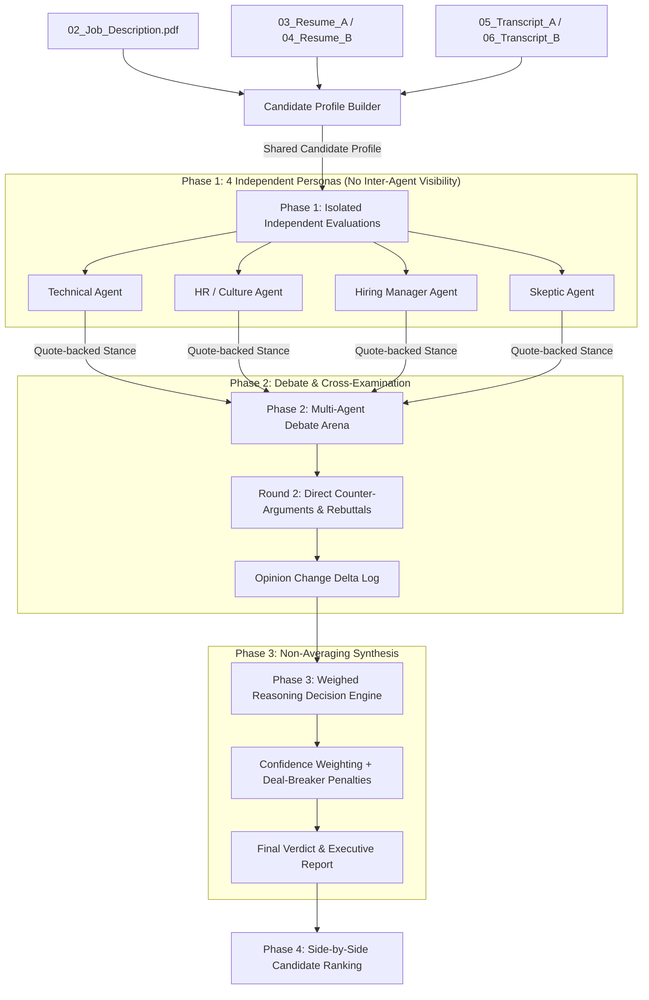

# 🤖 HireMind — Multi-Agent AI Interview Panel Simulator

[](https://python.org)
[](https://fastapi.tiangolo.com)
[](https://ai.google.dev)
[](LICENSE)

HireMind is an executive multi-agent AI hiring panel simulator designed to evaluate job candidates against specific Job Descriptions. It extracts shared facts from candidate resumes and interview transcripts, runs isolated persona assessments with quote-backed evidence, conducts a dynamic multi-round debate with cross-examination and opinion tracking, applies a weighted reasoning decision engine (non-averaging), generates comprehensive candidate reports, ranks candidates side-by-side, and provides an interactive web dashboard with live voice debate playback.

---

## 📸 Dashboard Overview & Features

### 🌟 Key Highlights
1. **Candidate Profile Builder**: Parses Job Description, Resume, and Transcript PDFs (`02_Job_Description.pdf` through `06_Transcript_B.pdf`), extracting shared facts, skills, claims, and topic-indexed quotes.
2. **4 Independent AI Personas**:
   - 🛠 **Technical Agent**: Evaluates hard technical depth, Python backend skills, agent patterns (LangGraph/CrewAI), RAG, and framework experience.
   - 🤝 **HR / Culture Agent**: Evaluates communication, teamwork, honesty, and accountability during outages.
   - 👔 **Hiring Manager Agent**: Evaluates direct alignment with Job Description duties (building React operator screens, directing Claude Code).
   - 🕵️‍♂️ **Skeptic Agent**: Audits candidate claims for resume inflation, timeline mismatches, and red flags.
   - *Phase 1 Isolation Rule*: All 4 agents evaluate candidates independently in isolated LLM calls (zero inter-agent visibility) and cite direct quotes for every assertion.
3. **Debate Step & Opinion Change Tracker**:
   - Multi-round debate where agents present initial stances, cross-examine each other, and issue direct counter-arguments.
   - Features an explicit **Opinion Change Delta Log** showing the exact moment an agent shifts its score/opinion after being presented with peer evidence.
4. **Weighed Reasoning Decision Engine**:
   - Does **NOT** use simple score averaging.
   - Weighs evidence strength, agent confidence %, role-critical deal-breakers (e.g. anti-AI tool stance), production blame deflection penalties, and skeptic audit findings.
   - Synthesizes final recommendations (`STRONG HIRE` vs `STRONG REJECT`), confidence levels, key strengths, concerns, and unresolved panel disputes.
5. **Bonus Features**:
   - 🔊 **Voice Debate Session Player**: Browser Web Speech API audio debate player with distinct voice pitches/rates for each persona (Technical, HR, Hiring Manager, Skeptic).
   - 📊 **Side-by-Side Candidate Ranking**: Comparative matrix comparing Candidate A (Rohan Malhotra) vs Candidate B (Maya Lin).

---

## 🏛 System Architecture



---

## 📁 Repository Structure

```
.
├── data/                       # Input PDF documents
│   ├── 02_Job_Description.pdf
│   ├── 03_Resume_A.pdf
│   ├── 04_Resume_B.pdf
│   ├── 05_Transcript_A.pdf
│   └── 06_Transcript_B.pdf
├── src/                        # Core Python multi-agent modules
│   ├── __init__.py
│   ├── profile_builder.py      # Extracts facts & quotes from PDFs
│   ├── agents.py               # 4 Isolated Persona Agents
│   ├── debate_engine.py        # Multi-round debate & delta tracker
│   ├── decision_engine.py      # Weighed reasoning synthesis & ranking
│   └── gemini_client.py        # Google Gemini API & fallback engine
├── static/                     # Web UI Dashboard
│   ├── index.html              # Dashboard markup
│   ├── app.js                  # Frontend logic & Voice Debate player
│   └── styles.css              # Custom styling
├── app.py                      # FastAPI Web server & REST endpoints
├── run_panel.py                # Command Line (CLI) execution script
├── generate_pdfs.py            # PDF document generator script
└── requirements.txt            # Python dependencies
```

---

## ⚡ Quick Start

### 1. Prerequisites & Installation

Clone the repository and install dependencies:
```bash
git clone <your-repo-url>
cd od
pip install -r requirements.txt
```

### 2. Set Up Environment Variables (Optional)

If you want to use live Google Gemini API calls, set your API key:
```bash
# Windows PowerShell
$env:GEMINI_API_KEY="your-google-gemini-api-key"

# Linux / MacOS
export GEMINI_API_KEY="your-google-gemini-api-key"
```
*(Note: If no API key is set, HireMind automatically uses its built-in fallback engine so the panel runs 100% offline).*

### 3. Generate Sample PDF Documents

Generate all 5 PDF files specified in the benchmark prompt:
```bash
python generate_pdfs.py
```

### 4. Run CLI Pipeline

Execute the multi-agent pipeline in your terminal:
```bash
python run_panel.py
```

### 5. Launch Interactive Web Dashboard

Start the FastAPI Web Server:
```bash
python app.py
```
Open **`http://127.0.0.1:8000`** in your browser to access the dashboard!

---

## 📊 Benchmark Results Summary

### Candidate A: Rohan Malhotra (Senior AI Engineer)
- **Initial Stance**: Technical Agent gave 8.0/10 for strong LangGraph multi-agent background. Skeptic and Hiring Manager gave low scores due to major red flags.
- **Debate Turning Point**: Skeptic Agent exposed resume inflation (*"Led 4-person team"* on resume vs *"I was a junior dev coordinating sub-tasks"* in transcript) and Hiring Manager highlighted Rohan's explicit refusal to use AI coding tools (*"I don't trust Claude Code... I forbid auto-generated code"*).
- **Opinion Shift**: Technical Agent revised score from **8.0 &rarr; 5.0/10**, recognizing his anti-AI tool philosophy negates his LangGraph strengths for Cargonet AI.
- **Final Verdict**: **STRONG REJECT** (Weighted Score: **1.7 / 10** | Confidence: **94%**).

### Candidate B: Maya Lin (Full-Stack AI Engineer)
- **Initial Stance**: High scores across HR (9.0), Hiring Manager (9.5), and Skeptic (8.0). Technical Agent initially gave 7.5 due to lack of custom LangGraph framework building.
- **Debate Turning Point**: Hiring Manager counter-argued that Maya's 3x velocity using Claude Code/Cursor and proven React UI skills mean she will master LangGraph in 2 weeks. HR Agent highlighted her exemplary production ownership during an OCR outage patch.
- **Opinion Shift**: Technical Agent upgraded score from **7.5 &rarr; 8.8/10**.
- **Final Verdict**: **STRONG HIRE** (Weighted Score: **10.0 / 10** | Confidence: **95%**).

---

## 🏆 Comparative Ranking Matrix

| Evaluation Dimension | Candidate A (Rohan Malhotra) | Candidate B (Maya Lin) | Winning Candidate |
|---|---|---|---|
| **AI Tool Direction (Claude Code)** | Refuses to use AI coding tools (0/10) | Mastered AI coding tools for 3x speed (10/10) | **Candidate B (Maya Lin)** |
| **React Frontend Capability** | No React coding in 2 years (2/10) | Active full-stack React UI experience (9/10) | **Candidate B (Maya Lin)** |
| **Production Ownership** | Deflects outage blame onto DevOps (3/10) | Direct personal accountability & rapid patch (10/10) | **Candidate B (Maya Lin)** |
| **Multi-Agent Framework Depth** | LangGraph & CrewAI in production (9/10) | Focused agent loops & RAG (7/10) | **Candidate A (Rohan Malhotra)** |
| **Resume Honesty & Integrity** | Embellished team leadership role (4/10) | Transparent, truthful credentials (10/10) | **Candidate B (Maya Lin)** |

**Winner**: **Maya Lin** (+9.0 pts score gap over Rohan Malhotra).

---

## 🛠 API Reference

| Endpoint | Method | Description |
|---|---|---|
| `GET /` | `GET` | Serves the interactive Web Dashboard |
| `GET /api/candidates` | `GET` | Returns list of available candidates |
| `GET /api/candidate/{id}` | `GET` | Returns full candidate profile, Phase 1 evals, Phase 2 debate transcript, and Phase 3 report |
| `GET /api/comparison` | `GET` | Returns comparative ranking matrix between candidates |

---

## 📜 License

This project is released under the [MIT License](LICENSE).
